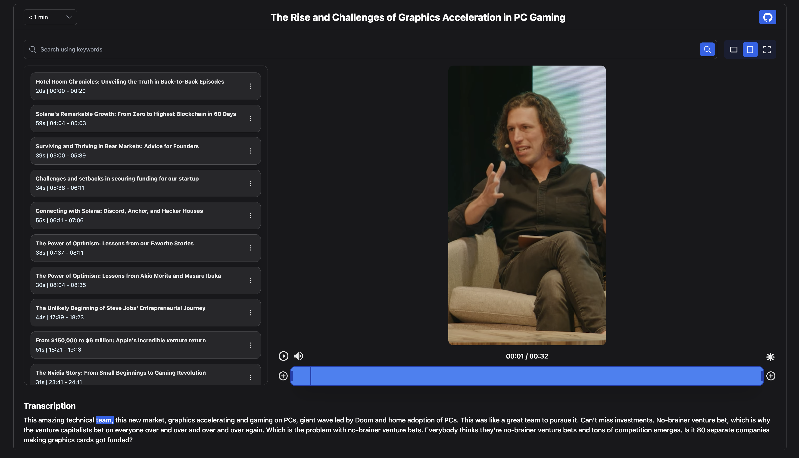

# ClipsAI UI Demo

<!-- [](https://badge.fury.io/py/project-name) -->
[](https://opensource.org/licenses/MIT)


## Introduction

Clips AI is an open-source Python library that automatically converts long videos into
clips. With just a few lines of code, you can segment a video into multiple clips and
resize its aspect ratio from 16:9 to 9:16. Check out the library
[here](https://github.com/ClipsAI/clipsai)

This repo provides a simple video trimming and resizing UI for the clips generated by
Clips AI. The clips used in the demo were all generated using the clipsai library.


> **Note:** Clips AI is designed for audio-centric, narrative-based videos such as
podcasts, interviews, speeches, and sermons. It actively employs video transcripts to
identify and create clips. Our resizing algorithm dynamically reframes and focuses on
the current speaker, converting the video into various aspect ratios.

> **Note:** When viewing in the 9:16 format, the cuts that happen when switching to a
different speaker to focus on is a bit glichy. This is due to the imprecise event triggers
that won't always trigger at the exact time when we need to switch to a different speaker
in the video. The times produced by the python library for resizing and switching frames
is accurate and cuts will be precise when using FFmpeg to crop the video.

For full documentation of the Clips AI library,
visit [Clips AI Documentation](https://docs.clipsai.com/)

### Installation

```bash
git clone git@github.com:ClipsAI/demo.git
```

```bash
npm i
```

```bash
npm run dev
```


